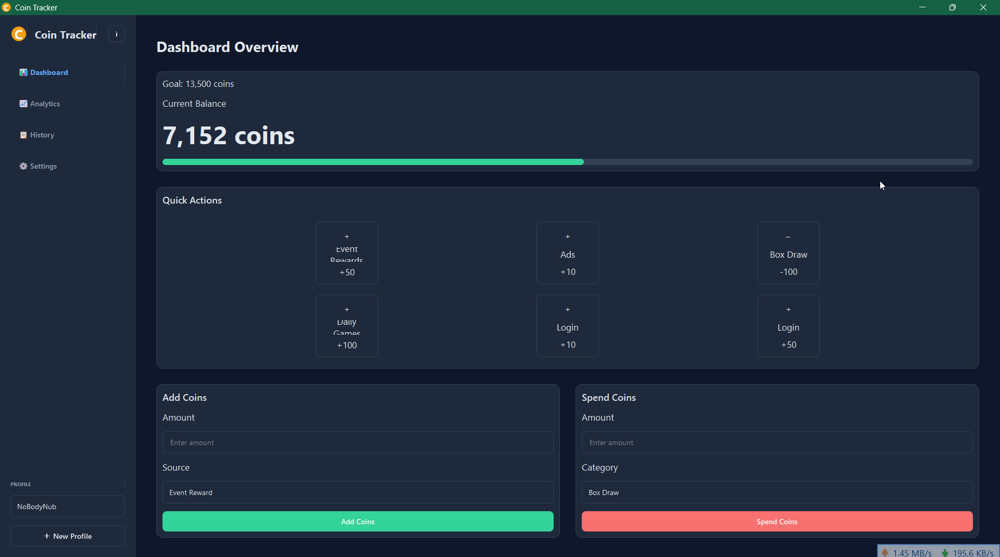
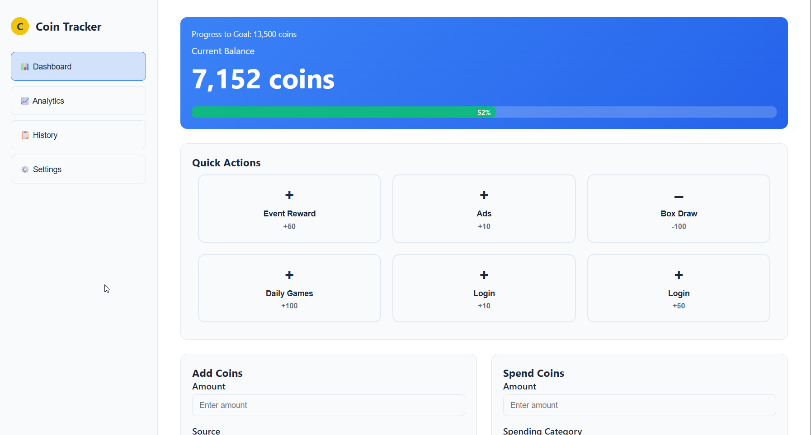

# CoinTracker 🪙

CoinTracker 🪙 is a dual-version coin tracking app with a **PyQt5 desktop GUI** and a **Flask web app**. Track coins, manage goals, view analytics, and sync your data locally or online via Firebase. Perfect for managing personal finances or digital tokens across platforms.

- **Desktop App**: PyQt5 GUI with local JSON storage + optional Firebase sync.  
- **Web App**: Flask-based web interface hosted online via Render with Firebase backend.  

Track coins, view analytics, manage goals, and keep your data synced online.

---

## 🗂️ Project Structure

```
├── desktop/
│ ├── coin_tracker.py # PyQt5 Desktop App logic
│ ├── build.py # PyInstaller build script
│ ├── coin_icon.py # Script to generate desktop icon
├── web/
│ ├── static/ # Web App static files (CSS, JS)
│ ├── templates/ # Web App HTML templates
│ ├── render.yaml # Render deployment configuration
│ ├── requirements.txt # Python dependencies
│ └── app.py # Flask Web App core logic
├── LICENSE # MIT License
├── README.md # This file
```
---

## 💻 Desktop App

### Features

- PyQt5 GUI with PyQtChart for visual analytics  
- Local JSON storage at `~/Documents/CoinTracker/<Profile>.json`  
- Optional Firebase sync for online backup  
- Quick transaction buttons, manual entries, and goal tracking  

### Setup

1. **Download & Run (Easiest Method)**

- You can download the latest standalone executable from the **[Releases Page](https://github.com/ifti136/Coin-Tracker/releases/tag/v1.0)**.
- Download `CoinTracker.exe`, place it anywhere on your system, and run it.

2. **Otherwise Clone the repository**

    ```bash
    git clone https://github.com/ifti136/coin-tracker.git
    cd CoinTracker
    ```

3. **Install dependencies**

    ```bash
    pip install -r web/requirements.txt
    ```

4. **Generate Desktop Icon (optional)**

    ```bash
    python coin_icon.py
    ```

5. **Build Desktop App**

    ```bash
    python build.py
    ```


---

## 🌐 Web App

### Features

- Flask-based web interface with dynamic dashboards  
- Analytics charts and transaction history  
- Goal management and data import/export  
- Syncs with Firebase for online storage  

---

### Step 1: Set Up Firebase

1. Go to [Firebase Console](https://console.firebase.google.com/) → Create a new project  
2. Go to **Project Settings → Service Accounts → Generate new private key**  
3. Save the JSON file safely. You’ll need values like:  
   - `client_email`  
   - `private_key`  
   - `private_key_id`  
   - `project_id`  

4. Optional: Enable **Firestore Database** for real-time syncing  

---

### Step 2: Environment Variables

Create a `.env` file inside `web/`:

    SECRET_KEY=your_flask_secret
    FIREBASE_CLIENT_EMAIL=your_client_email
    FIREBASE_PRIVATE_KEY="your_private_key_with_newlines_escaped"
    FIREBASE_PRIVATE_KEY_ID=your_private_key_id
    FIREBASE_PROJECT_ID=your_project_id

> ⚠️ For `FIREBASE_PRIVATE_KEY`, replace newlines with `\n` if copying from JSON.

---

### Step 3: Install Dependencies

    cd web
    pip install -r requirements.txt

---

### Step 4: Run Web App Locally

    flask run

- Open [http://127.0.0.1:5000](http://127.0.0.1:5000)  
- You should see the CoinTracker dashboard  

---

### Step 5: Deploy on Render

1. Create a new **Web Service** on [Render](https://render.com/)  
2. Connect your GitHub repo  
3. Set **Environment** to Python  
4. Add environment variables from your `.env` file  
5. Use `pip install -r requirements.txt` as the **Build Command**  
6. Use `gunicorn app:app` as the **Start Command**  
7. Click **Deploy**  

After deployment, your web app will be live online, syncing data with Firebase.

---

## 📝 Usage

- **Desktop**: Launch executable → manage coins → view goals → export/import data  
- **Web**: Open in browser → navigate sidebar → track coins → view analytics  

---

## 📷 Screenshots




---

## 🛠️ Contributing

1. Fork the repository  
2. Create a new branch: `git checkout -b feature-name`  
3. Make changes → `git commit -m "Add feature"`  
4. Push branch → Open Pull Request  

---
